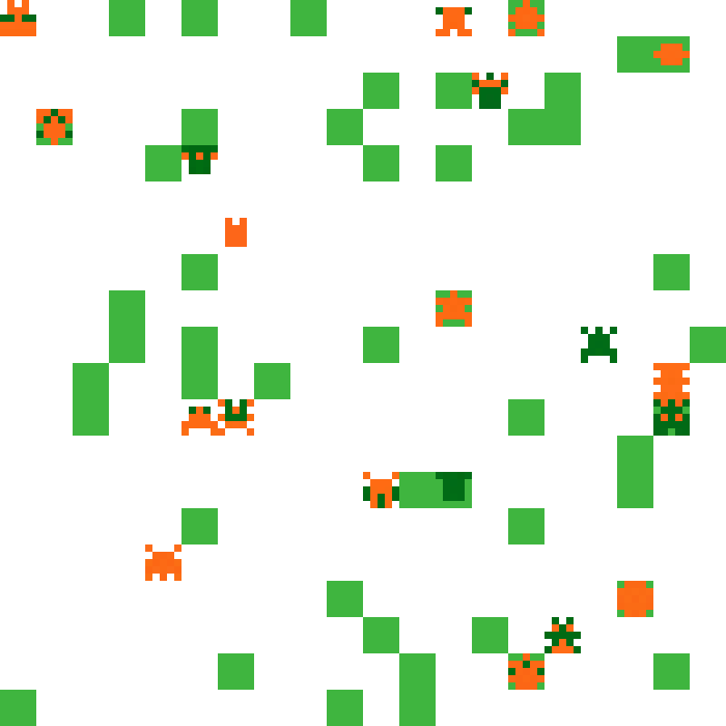

# Evolution Simulator

---

Evolution Simulator is a neural-network based software to host a front-end display of creatures evolving. 

Evolution Simulator has a number of tools for the user to create an environment and place organisms, then watch as the organisms become adapted to living in the custom environment over time. 

# Getting Started

### Prerequisites

1. Install python tutorial [here](https://kinsta.com/knowledgebase/install-python/).
2. Install Python dependencies
    
    ```jsx
    pip install -r requirements.txt
    ```
3. run example internal evolution training. This will show some of the training process that occurs behind the scenes. 
   ```commandline
   python -m games.survival.survival
   ```
   press `q` to quit the simulation



### Running the application

Once the necessary dependencies have been installed, run main.py. This can be achieved in terminal by calling the following command.

```python
python -m main
```

> If you encounter an error with dependencies after installing *requirements.txt*, run the commands in **Known Bugs.**
> 

After running main you will see:

```jsx
WARNING: This is a development server. Do not use it in a production deployment. Use a production WSGI server instead.
 * Running on http://127.0.0.1:5000
Press CTRL+C to quit
```

Visiting the displayed address will take you to the local webpage where you can use the Evolution Simulator.

# Documentation

[Here](https://lumbar-haddock-2e2.notion.site/Evolution-Simulation-e12f50a180fe490a842e340b1ee03c76) is the documentation.

### Known Bugs

If you have trouble installing the program after installing *requirements.txt*, the following commands are a known fix.

```python
pip install flask
pip install toml
pip install opencv-python
sudo apt-get update
sudo apt-get install libgl1-mesa-glx
```